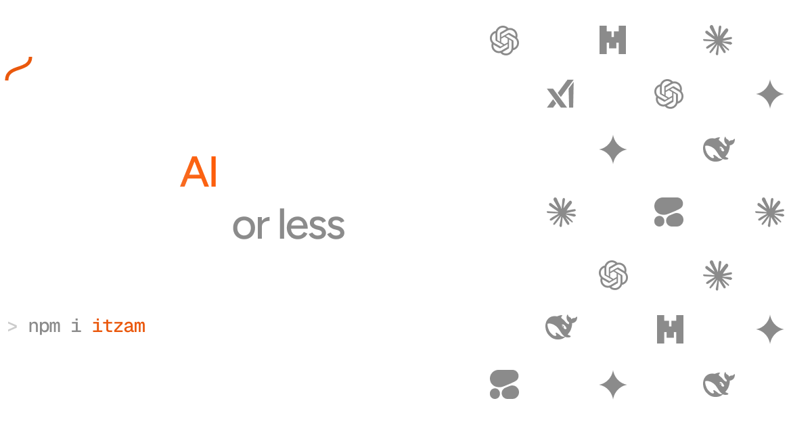

> [!WARNING]  
> Itzam is in a development hiatus, we are trying to get to 10 paid users or 1000 sign-ups by the end of june.
>
> If you have any ideas, or advice, or are willing to invest, please get in touch [@heyimgustavo](x.com/heyimgustavo) [@abdulhdr1](x.com/abdulhdr1)

# Itzam

[Itzam](https://itz.am) is an open-source platform for integrating AI.

## Demo

[](https://www.youtube.com/watch?v=NKIk7dPRUM0)

## What we do?

We help you **create AI applications**. Itzam’s purpose is to give developers the best possible experience when developing AI apps.

What this means?

- Swap models automatically or with one click;
- Change the current prompt easily;
- Integrate in 2 minutes;
- And much more… (see more features below)

## How it works

We are divided into 2 components: the Dashboard and the Integrations (API & SDKs).

For example, let's imagine you want to create a support chat in your landing page and want it to be powered by AI.

Here’s how you would do this with Itzam:

### Dashboard

Everything starts in the dashboard, where you will create a **Workflow**. A **Workflow** represents a functionality in your app, in this case, the support chat.

1. Create a **Workflow** called “Support Chat”.
2. Inside your **Workflow** you can set:
   - AI model (GPT o3, Claude 3.7, Gemini 2.5)
   - Model settings (style, response length)
   - Prompt (e.g. “You are a customer support agent from Acme Inc…”)
   - Knowledge (what the model will use as context, e.g. company docs, links)
3. Great, now grab this **Workflow**’s slug and an API key in the dashboard and let's integrate!

### API & SDKs

Now it’s time to integrate the **Workflow** in your app.

1. Use the API key to authenticate:

   ```jsx
   import { Itzam } from "itzam";

   const itzam = new Itzam("my-great-api-key");
   ```

2. Use the **Workflow**’s slug to run it with your user’s input:

   ```jsx
   const response = await itzam.generateText({
     input: "I am having trouble finding your documentation...",
     workflowSlug: "support-chat",
   });

   console.log(response.text);
   // > "Follow this link to access our documentation: acme.com/docs"
   ```

## Features

### 🤖  Model Hot Swap

Change the current model - or the model settings - instantly.

### 💬  Prompt Management

Change the prompt instantly and compare the output with other executions.

### 💳  Costs & Usage

Track all your AI spending in one place.

### 👨🏻‍💻  Easy SDKs & API

Integrate AI in your product with 4 lines of code.

### 🛝  Playground

Tweak and test your workflow in the playground.

### 🧠  Knowledge

Manage the context - docs, images, links, texts - you want to give to the AI for each workflow.

## Next features

### 🖼️  Attachments

Send attachments - docs, images - via API & SDKs.

### 📐  Rules

Create custom rules for each workflow.

e.g. if AI bill is over $50 → switch to a cheaper model.

### ✨  Model Recommendation

Get recommendations on the best model (balancing cost, latency, and intelligence).

### 🚧  Guardrails

Create limits for the AI’s response.

For more details, check [TODO.md](TODO.md).

## Docs

Check out our docs at [docs.itz.am](https://docs.itz.am)!

## Links

- Itzam: [itz.am](http://itz.am)
- Itzam Docs: [docs.itz.am](http://docs.itz.am)
- Roadmap: [itz.am/roadmap](https://itz.am/roadmap)
- Available models: [itz.am/models](https://itz.am/models)
